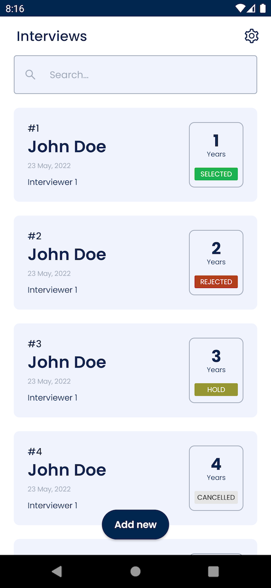
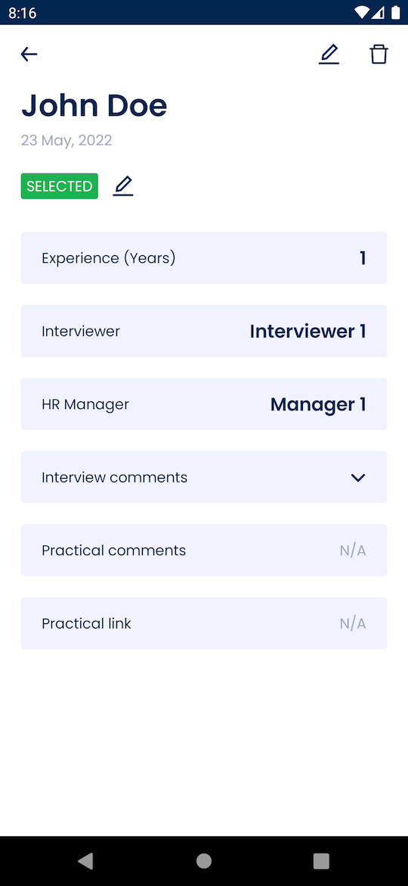

# Interviews App

This is a prototype to demonstrate use of [Jetpack Compose][COMPOSE_LINK] in a multi screen application.

## Key Features
* Jetpack Compose for UI.
* Single Activity and multiple Fragments to handle navigation.
* Use of nested scrolling between BottomSheetDialogFragment and LazyColumn.
* Use of Compose along with xml views.

## Built With
* [Jetpack Compose][COMPOSE_LINK]
* MVVM architecture
* [Hilt][HILT_LINK]
* [FragNav][FRAG_NAV_LINK] for navigation
* Many more utility classes

&nbsp;

# Screens

## Interviews

## Interview Details

[COMPOSE_LINK]: https://developer.android.com/jetpack/compose
[HILT_LINK]: https://developer.android.com/training/dependency-injection/hilt-android
[FRAG_NAV_LINK]: https://github.com/ncapdevi/FragNav