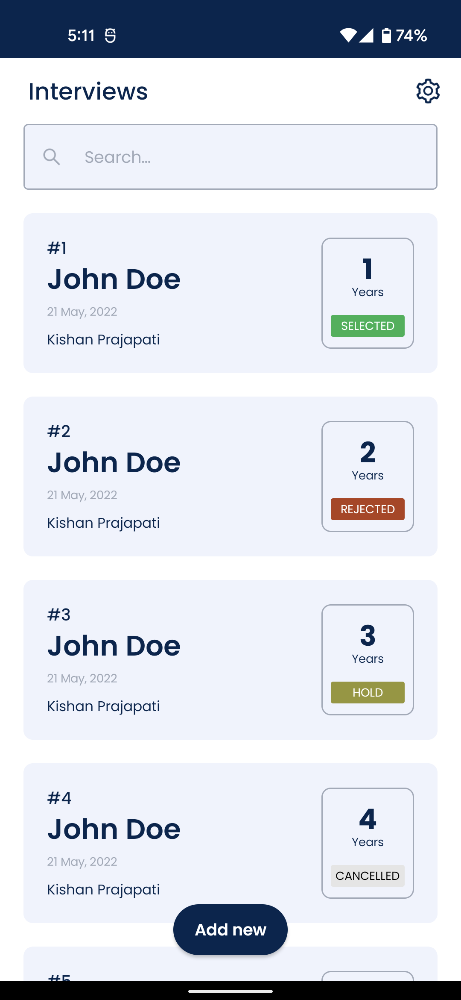
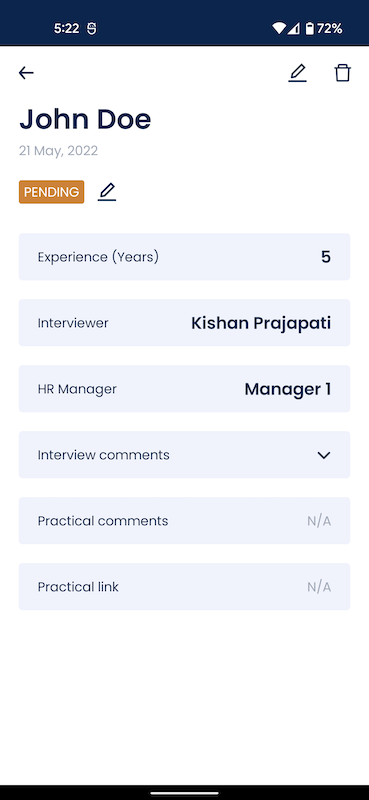

# Interviews App

This is a prototype to demonstrate use of Jetpack Compose in a multi screen application.

## Key Features
* Jetpack Compose for UI.
* Single Activity and multiple Fragments to handle navigation.
* Use of nested scrolling between BottomSheetDialogFragment and LazyColumn.

## Built With
* Jetpack Compose
* MVVM architecture
* Hilt
* FragNav for navigation
* Many more utility classes

&nbsp;

# Screens

## Interviews

## Interview Details

